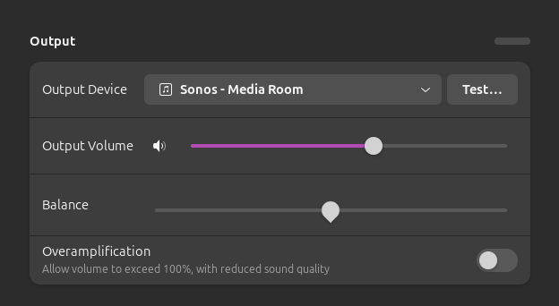
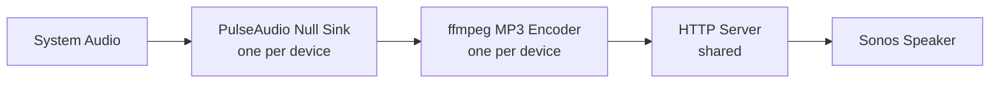
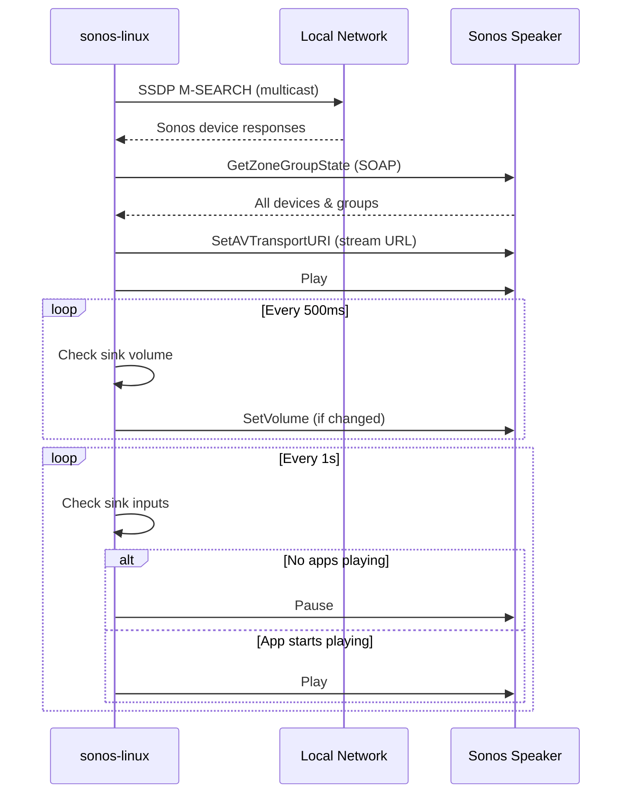
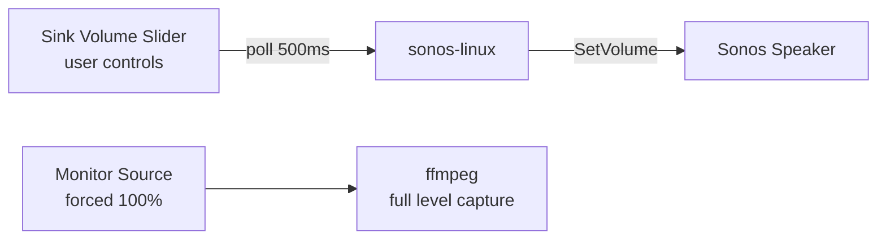

# sonos-linux

Stream your Linux system audio to Sonos speakers over the local network.



Discovers all Sonos speakers and creates a virtual audio sink for each one (e.g. "Sonos - Living Room"). Route your system audio to any of them and it plays on that speaker. Runs as a systemd user service with a system tray icon, volume sync, and auto-pause when idle.

> **⚠️ IMPORTANT: There is a 2-5 second audio delay.** This is inherent to how Sonos works — the speaker buffers several seconds of audio before playing. This cannot be reduced or eliminated. This tool is great for music, podcasts, and background audio, but **not suitable for video playback or gaming** where audio sync matters.

## Features

- Auto-discovers all Sonos speakers on the network via SSDP
- Creates a virtual PulseAudio sink per speaker ("Sonos - {name}")
- Volume sync: sink volume slider controls Sonos volume
- Auto-pause: stops Sonos when no apps are playing, resumes when audio returns
- System tray icon with device groups, details, and quit
- Filters out subwoofers, bridges, and satellite devices automatically
- Starts at login via systemd, restarts on failure

## Requirements

- **Go** 1.22+ (build only)
- **PulseAudio** or **PipeWire** (with pipewire-pulse)
- **pulseaudio-utils** — `pactl` for virtual sink management
- **ffmpeg** — audio capture and MP3 encoding
- **python3-gi** + **gir1.2-gtk-3.0** — system tray icon

On Debian/Ubuntu:

```bash
sudo apt install pulseaudio-utils ffmpeg python3-gi gir1.2-gtk-3.0
```

## Install

### From .deb (recommended)

Download the latest `.deb` from [Releases](../../releases), then:

```bash
sudo dpkg -i sonos-linux_*.deb
systemctl --user enable --now sonos-linux
```

### From source

```bash
make build
sudo make install
make enable
```

## Uninstall

### .deb

```bash
systemctl --user disable --now sonos-linux
sudo dpkg -r sonos-linux
```

### From source

```bash
sudo make uninstall
```

## Usage

After install, it runs automatically as a systemd user service. Or run manually:

```bash
sonos-linux
```

1. Discovers all Sonos speakers on your network
2. Creates a virtual audio sink per playable speaker
3. Starts an MP3 stream server
4. Connects each Sonos to its stream
5. Shows a system tray icon with device info
6. Route your audio to any "Sonos - {name}" sink in sound settings

Use the tray icon Quit menu or Ctrl+C to stop.

### Manage the service

```bash
make enable                            # start now + auto-start at login
make disable                           # stop and disable auto-start
systemctl --user status sonos-linux    # check status
journalctl --user -u sonos-linux       # view logs
systemctl --user restart sonos-linux   # restart
```

### Scan devices

```bash
sonos-linux --scan-devices
```

Lists all discovered Sonos devices with full details (model, IP, UUID, firmware, group, coordinator status) without starting any streams.

## Architecture

### Audio pipeline



### Discovery and control



### Volume sync




## Project structure

```
sonos-linux/
├── main.go                 # entry point, lifecycle, volume sync, activity monitor
├── tray.go                 # spawns Python tray helper, passes device JSON
├── tray.py                 # GtkStatusIcon system tray (groups → devices → details)
├── sonos/
│   ├── types.go            # Device struct, CanPlay() filter
│   ├── discover.go         # SSDP discovery, zone group topology parsing
│   ├── device_info.go      # fetch model/serial/firmware from device XML
│   ├── control.go          # UPnP/SOAP: play, pause, stop, volume
│   └── soap.go             # SOAP envelope building and response parsing
├── audio/
│   ├── sink.go             # PulseAudio null sink create/destroy, volume, activity
│   └── encoder.go          # ffmpeg capture from monitor → MP3
├── stream/
│   └── server.go           # HTTP broadcast server, fan-out to Sonos clients
├── sonos-linux.service     # systemd user service
├── Makefile                # build, install, enable, disable, uninstall
├── go.mod
└── go.sum
```

## Disclaimer

This project is not affiliated with, endorsed by, or associated with Sonos, Inc. in any way. Sonos is a registered trademark of Sonos, Inc. This is an independent open-source project that uses publicly available UPnP/SOAP protocols to communicate with Sonos devices on your local network.
